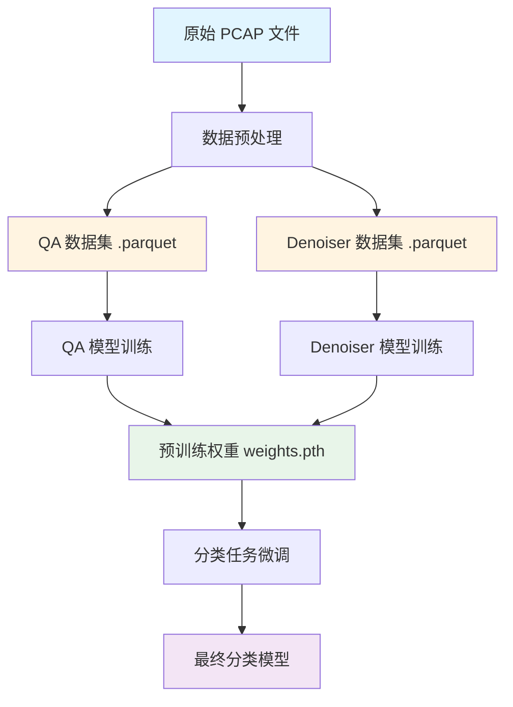
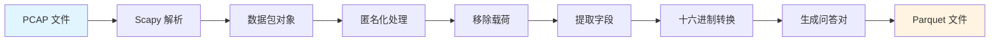
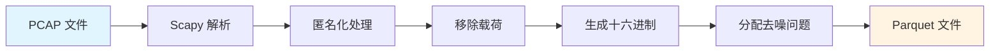
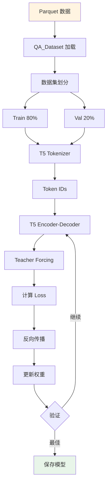
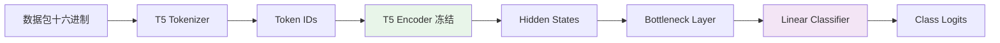
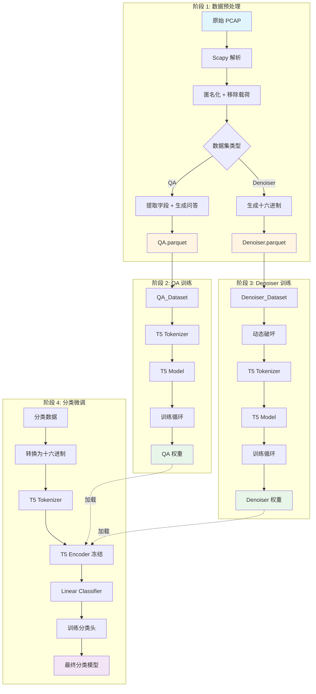

# Part 1: PCAP_encoder 预训练模型完整训练链路

## 📋 目录

- [概述](#概述)
- [整体架构](#整体架构)
- [阶段 1: 数据预处理](#阶段-1-数据预处理)
- [阶段 2: QA 模型训练](#阶段-2-qa-模型训练)
- [阶段 3: Denoiser 模型训练](#阶段-3-denoiser-模型训练)
- [阶段 4: 分类任务微调](#阶段-4-分类任务微调)
- [数据流转总览](#数据流转总览)

---

## 概述

PCAP_encoder 是一个基于 T5 模型的网络流量表示学习框架，通过两种自监督预训练任务（问答和去噪）学习数据包的语义表示，最终用于下游的分类任务。

### 核心理念

将网络数据包视为"文本"，利用 NLP 领域的预训练技术：
- **问答任务 (QA)**: 从十六进制数据包中提取特定字段值
- **去噪任务 (Denoiser)**: 重建被破坏的数据包
- **下游应用**: 使用学到的表示进行流量分类

---

## 整体架构



---

## 阶段 1: 数据预处理

### 1.1 QA 数据集生成

#### 脚本位置
```
Preprocess/FromPCAPtoQADataset.py
```

#### 输入
- **格式**: PCAP 文件（原始网络流量捕获）
- **来源**: Wireshark、tcpdump 等工具捕获的网络流量
- **内容**: 包含完整的网络数据包（Ethernet、IP、TCP/UDP/ICMP 等层）

#### 处理流程



##### 步骤 1: 读取 PCAP 文件

**函数**: `read_pcap_header(input_path)`

```python
# 流式读取，避免内存溢出
from scapy.all import PcapReader

with PcapReader(pcap_file) as pcap_reader:
    for pkt in pcap_reader:
        # 处理每个数据包
```

**输出**: Scapy 数据包对象列表

##### 步骤 2: 匿名化处理

**函数**: `modify_IPv4packets(pkt)`, `modify_IPv6packets(pkt)`

**目的**:
- 隐私保护：避免暴露真实 IP 地址
- 泛化能力：防止模型记住特定 IP
- 数据增强：同一个包每次处理 IP 都不同

**处理内容**:
```python
# IPv4 匿名化
pkt[IP].src = generate_rnd_IP()  # 随机 IP，如 "192.168.1.100"
pkt[IP].dst = generate_rnd_IP()
pkt[IP].ttl = random.randint(1, 255)  # 随机 TTL

# IPv6 匿名化
pkt[IPv6].src = generate_rnd_IPv6()  # 如 "2001:0db8:85a3:..."
pkt[IPv6].dst = generate_rnd_IPv6()
pkt[IPv6].hlim = random.randint(1, 255)  # 随机 Hop Limit
```

**输入**: 原始数据包
```
IP src=10.0.0.1 dst=10.0.0.2 ttl=64
```

**输出**: 匿名化数据包
```
IP src=192.168.45.123 dst=172.16.89.201 ttl=128
```

##### 步骤 3: 移除载荷（可选）

**函数**: `remove_payload(pkt)`

**配置**: `PAYLOAD = False`（默认移除）

**目的**:
- 减少噪声：HTTPS 等加密流量的载荷是随机的
- 聚焦协议：协议头部包含更多结构化信息
- 减小数据：加快训练速度

**处理逻辑**:
```python
if TCP in pkt:
    del pkt[TCP].payload  # 移除 TCP 载荷
elif UDP in pkt:
    del pkt[UDP].payload  # 移除 UDP 载荷
# ICMP 不移除（载荷通常不加密）
```

**输入**: 完整数据包（含载荷）
```
Ethernet / IP / TCP / Raw(load='GET /index.html HTTP/1.1...')
```

**输出**: 仅协议头
```
Ethernet / IP / TCP
```

##### 步骤 4: 提取字段

**函数**: `pkt2dict(pkt)`

**处理**: 利用 Scapy 的 `show2()` 方法解析数据包

**输入**: Scapy 数据包对象

**输出**: 嵌套字典
```python
{
    'Ethernet': {
        'dst': 'ff:ff:ff:ff:ff:ff',
        'src': '00:11:22:33:44:55',
        'type': '0x800'
    },
    'IP': {
        'version': 4,
        'ihl': 5,
        'tos': 0,
        'len': 60,
        'id': 7238,
        'flags': 'DF',
        'frag': 0,
        'ttl': 64,
        'proto': 'tcp',
        'chksum': '0x1c46',
        'src': '192.168.1.1',
        'dst': '192.168.1.2'
    },
    'TCP': {
        'sport': 443,
        'dport': 54321,
        'seq': 1234567890,
        'ack': 987654321,
        'dataofs': 5,
        'flags': 'PA',
        'window': 65535,
        'chksum': '0x5a3c',
        'urgptr': 0
    }
}
```

##### 步骤 5: 十六进制转换

**函数**: `convert_hexadecimal(dict_pkt, pkt)`

**目的**: 将字段值转换为十六进制，与数据包的原始表示一致

**转换规则**:
```python
# IP 地址: 192.168.1.1 -> c0a8 0101
'192.168.1.1' -> 'c0a80101'

# 端口号: 443 -> 01bb
443 -> '01bb'

# 序列号: 1234567890 -> 499602d2
1234567890 -> '499602d2'

# 标志位: 'PA' -> 18
'PA' -> '18'
```

**输出**: 十六进制字典
```python
{
    'IP': {
        'src': 'c0a80101',
        'dst': 'c0a80102',
        'ttl': '40',
        'chksum': '1c46',
        ...
    },
    'TCP': {
        'sport': '01bb',
        'dport': 'd431',
        ...
    }
}
```

##### 步骤 6: 生成数据包十六进制字符串

**函数**: `bytes_hex(pkt).decode()`

**处理**: 将整个数据包转换为十六进制字符串

**输入**: Scapy 数据包对象

**输出**: 原始十六进制字符串（无空格）
```
4500003c1c46400040067c46c0a80101c0a8010201bbd431499602d23ade32b15018ffff5a3c0000
```

##### 步骤 7: 格式化十六进制字符串

**配置**: `PKT_FORMAT = "every4"`（默认）

**三种格式**:

| 格式 | 示例 | 说明 |
|------|------|------|
| `every4` | `4500 003c 1c46 4000` | 每 4 字符一组（推荐） |
| `every2` | `45 00 00 3c 1c 46 40 00` | 每 2 字符一组（字节级） |
| `noSpace` | `4500003c1c464000` | 无分隔（最紧凑） |

**输出**: 格式化的十六进制字符串
```
4500 003c 1c46 4000 4006 7c46 c0a8 0101 c0a8 0102 01bb d431 4996 02d2 3ade 32b1 5018 ffff 5a3c 0000
```

##### 步骤 8: 生成问答对

**函数**: `create_list_questions()`, 主循环

**问题模板文件**: `questionsQA.txt`

**问题示例**:
```
What is the source IP?
What is the destination IP?
What is the source port?
What is the destination port?
What is the TTL?
What is the TCP flags?
What is the IP checksum?
...
```

**生成逻辑**:
```python
for pkt_dict, hex_string in zip(list_dict_values, list_dict_hex):
    for layer in pkt_dict:
        for field in pkt_dict[layer]:
            question = f"What is the {layer}.{field}?"
            context = hex_string  # 完整数据包十六进制
            answer = pkt_dict[layer][field]  # 字段的十六进制值
            
            # 添加到数据集
            qa_pairs.append({
                'question': question,
                'context': context,
                'answer': answer,
                'pkt_field': f"{layer}.{field}"
            })
```

**输出示例**:

| question | context | answer | pkt_field |
|----------|---------|--------|-----------|
| What is the source IP? | 4500 003c 1c46 ... | c0a8 0101 | IP.src |
| What is the destination IP? | 4500 003c 1c46 ... | c0a8 0102 | IP.dst |
| What is the source port? | 4500 003c 1c46 ... | 01bb | TCP.sport |
| What is the TCP flags? | 4500 003c 1c46 ... | 18 | TCP.flags |

##### 步骤 9: 保存为 Parquet

**输出文件**: `Train_QA.parquet`, `Test_QA.parquet`

**数据格式**:
```python
DataFrame columns:
- question: str      # 问题
- context: str       # 数据包十六进制字符串
- answer: str        # 答案（十六进制）
- pkt_field: str     # 字段类型（用于分析）
```

**文件大小**: 取决于 PCAP 文件大小，通常几 MB 到几 GB

#### 完整数据流

```
原始 PCAP
    ↓
[Scapy 解析]
    ↓
数据包对象: Ethernet/IP/TCP/...
    ↓
[匿名化] IP: 10.0.0.1 → 192.168.45.123
    ↓
[移除载荷] Ethernet/IP/TCP/Raw → Ethernet/IP/TCP
    ↓
[提取字段] {'IP': {'src': '192.168.45.123', ...}, 'TCP': {...}}
    ↓
[十六进制转换] {'IP': {'src': 'c0a82d7b', ...}, 'TCP': {...}}
    ↓
[生成十六进制字符串] "4500 003c 1c46 4000 ..."
    ↓
[生成问答对]
    question: "What is the source IP?"
    context: "4500 003c 1c46 4000 ..."
    answer: "c0a8 2d7b"
    ↓
Parquet 文件
```

---

### 1.2 Denoiser 数据集生成

#### 脚本位置
```
Preprocess/FromPCAPtoDenoiserDataset.py
```

#### 输入
- **格式**: PCAP 文件（同 QA 数据集）

#### 处理流程

与 QA 数据集类似，但更简单：



##### 主要差异

1. **不提取字段**: 只需要完整的十六进制字符串
2. **问题模板**: 从 `questionsDenoiser.txt` 随机选择

**问题示例**:
```
Reconstruct the original packet
Denoise this network packet
Fix the corrupted packet header
Restore the packet to its original form
```

##### 输出格式

**文件**: `Train_Denoiser.parquet`, `Test_Denoiser.parquet`

**数据格式**:
```python
DataFrame columns:
- question: str      # 去噪指令
- context: str       # 数据包十六进制字符串（训练时会被破坏）
```

**示例**:

| question | context |
|----------|---------|
| Reconstruct the original packet | 4500 003c 1c46 4000 4006 7c46 c0a8 0101 ... |
| Denoise this network packet | 4500 0028 a3f2 4000 4006 9960 c0a8 0165 ... |

#### 数据破坏（在训练时动态进行）

破坏策略在 `Core/classes/dataset_for_denoiser.py` 中实现：

```python
# 破坏率 (Corruption Rate)
CR = 15  # 15% 的 token 被破坏

# 破坏方法
原始: "4500 003c 1c46 4000 4006 7c46"
破坏: "4500 <extra_id_0> 1c46 <extra_id_1> 4006 7c46"

# T5 的去噪格式
输入: "4500 <extra_id_0> 1c46 <extra_id_1> 4006 7c46"
目标: "<extra_id_0> 003c <extra_id_1> 4000 <extra_id_2>"
```

---

## 阶段 2: QA 模型训练

### 2.1 训练脚本

#### 位置
```
2.Training/QA/train.py
Experiments/4_QA_model_training/T5QandA.sh
```

### 2.2 输入

#### 数据文件
- **训练集**: `1.Datasets/QA/Train_QA.parquet`
- **测试集**: `1.Datasets/QA/Test_QA.parquet`

#### 配置参数（来自 `.sh` 脚本）

```bash
# 模型配置
MODEL_NAME="T5-base"              # T5 模型名称
TOKENIZER_NAME="T5-base"          # 分词器名称
BOTTLENECK="mean"                 # 瓶颈层类型: mean/first/last

# 训练配置
BATCH_SIZE=4                      # 批大小
EPOCHS=2                          # 训练轮数
LR=0.0005                         # 学习率
MAX_QST_LENGTH=512                # 问题+上下文最大长度
MAX_ANS_LENGTH=32                 # 答案最大长度
PERC=1                            # 使用数据集的百分比 (1-100)
SEED=43                           # 随机种子

# 输入格式
INPUT_FORMAT="every4"             # 十六进制格式
```

### 2.3 训练流程



#### 步骤 1: 数据加载

**类**: `Core/classes/dataset_for_QA.py` - `QA_Dataset`

```python
# 加载 Parquet 文件
dataset_obj = QA_Dataset(opts, tokenizer_obj)
dataset_obj.load_dataset(
    input_path="Train_QA.parquet",
    test_path="Test_QA.parquet",
    format="every4"
)

# 数据格式化
# 移除空格
context = context.replace(" ", "")  # "4500003c1c46..." 

# 重新分组（根据 format）
if format == "every4":
    context = ' '.join([context[i:i+4] for i in range(0, len(context), 4)])
    # "4500 003c 1c46 ..."
```

**输入**: Parquet 文件
```python
{
    'question': 'What is the source IP?',
    'context': '4500003c1c464000...',  # 无空格
    'answer': 'c0a80101',
    'pkt_field': 'IP.src'
}
```

**输出**: 格式化数据
```python
{
    'question': 'What is the source IP?',
    'context': '4500 003c 1c46 4000 ...',  # 每4字符一组
    'answer': 'c0a80101'
}
```

#### 步骤 2: 数据集划分

**方法**: `split_train_val_test(percentage)`

```python
# 使用指定百分比的数据
num_rows = int(len(data) * percentage / 100)
data_sampled = data.sample(n=num_rows, random_state=seed)

# 划分训练集和验证集 (80/20)
train_data, val_data = train_test_split(
    data_sampled, 
    test_size=0.2, 
    random_state=seed
)
```

**输出**:
- 训练集: 80% 的数据
- 验证集: 20% 的数据
- 测试集: 独立的 Test_QA.parquet

#### 步骤 3: 分词编码

**类**: `Core/classes/tokenizer.py` - `QA_Tokenizer_T5`

**T5 输入格式**:
```python
# 问题 + 上下文
input_text = f"question: {question} context: {context}"

# 示例
"question: What is the source IP? context: 4500 003c 1c46 4000 ..."
```

**分词过程**:
```python
# 编码输入
question_tokenized = tokenizer.tokenize_question(question, context)
# 返回:
{
    'input_ids': [1, 822, 19, 8, 1391, 2465, 58, ...],  # Token IDs
    'attention_mask': [1, 1, 1, 1, 1, 1, 1, ...]        # 注意力掩码
}

# 编码答案
answer_tokenized = tokenizer.tokenize_answer(answer)
# 返回:
{
    'input_ids': [3, 75, 632, 505, 3, 632, 3, 2, 3, 4, 3, 2, 1],
    'attention_mask': [1, 1, 1, 1, 1, 1, 1, 1, 1, 1, 1, 1, 1]
}
```

**输出**: 模型输入格式
```python
{
    'input_ids': Tensor([1, 822, 19, 8, ...]),           # 编码器输入
    'attention_mask': Tensor([1, 1, 1, 1, ...]),         # 编码器注意力
    'labels': Tensor([3, 75, 632, 505, ...]),            # 解码器目标
    'decoder_attention_mask': Tensor([1, 1, 1, ...]),    # 解码器注意力
    'decoder_input_ids': Tensor([0, 3, 75, 632, ...])    # 解码器输入
}
```

#### 步骤 4: 模型定义

**类**: `Core/classes/T5_model.py` - `T5_PCAP_translator`

```python
# 加载预训练 T5 模型
from transformers import T5ForConditionalGeneration

model = T5ForConditionalGeneration.from_pretrained("T5-base")

# T5-base 架构
- Encoder: 12 层 Transformer
- Decoder: 12 层 Transformer
- Hidden size: 768
- Attention heads: 12
- Parameters: ~220M
```

**瓶颈层配置**:
```python
# 用于提取数据包表示
if bottleneck == "mean":
    # 平均池化所有 token
    representation = hidden_states.mean(dim=1)  # [batch, 768]
elif bottleneck == "first":
    # 使用第一个 token (类似 BERT [CLS])
    representation = hidden_states[:, 0, :]     # [batch, 768]
elif bottleneck == "last":
    # 使用最后一个 token
    representation = hidden_states[:, -1, :]    # [batch, 768]
```

#### 步骤 5: 训练循环

**方法**: `start_training()`

```python
for epoch in range(num_epochs):
    for batch in train_loader:
        # 前向传播
        outputs = model(
            input_ids=batch['input_ids'],
            attention_mask=batch['attention_mask'],
            labels=batch['labels'],
            decoder_attention_mask=batch['decoder_attention_mask']
        )
        
        # 计算损失 (Cross-Entropy)
        loss = outputs.loss
        
        # 反向传播
        accelerator.backward(loss)
        
        # 更新参数
        optimizer.step()
        lr_scheduler.step()
        optimizer.zero_grad()
        
    # 验证
    val_loss = validation_batch(model, val_loader)
    
    # 保存最佳模型
    if val_loss < best_loss:
        save_model(model, "best_model")
```

**损失函数**: Cross-Entropy Loss
```python
# T5 使用 Teacher Forcing
# 给定输入，预测下一个 token

输入序列: "question: What is the source IP? context: 4500 003c ..."
目标序列: "c0a8 0101"

# 模型预测每个位置的 token 概率分布
# 损失 = -log P(正确 token)
```

#### 步骤 6: 验证和保存

**验证指标**:
```python
# 1. 验证损失
val_loss = average_loss_on_validation_set

# 2. 准确率（按字段类型）
accuracy_by_field = {
    'IP.src': 0.95,
    'IP.dst': 0.94,
    'TCP.sport': 0.92,
    'TCP.dport': 0.91,
    ...
}

# 3. 整体准确率
overall_accuracy = correct_predictions / total_predictions
```

**模型保存**:
```python
# 保存路径
output_path = "results/TrainingQA/Denoiser0450K_QA_Hard_mean_seed43_512/
               task-supervised_lr-0.0005_epochs-20_batch-24/seed_43/best_model"

# 保存内容
- pytorch_model.bin       # 模型权重
- config.json             # 模型配置
- training_args.bin       # 训练参数
```

### 2.4 输出

#### 训练好的模型
- **位置**: `results/.../best_model/`
- **格式**: PyTorch 模型文件
- **大小**: ~220M (T5-base)

#### 训练日志
```
Epoch 1/2:
  Train Loss: 2.345
  Val Loss: 1.987
  Accuracy: 0.856

Epoch 2/2:
  Train Loss: 1.654
  Val Loss: 1.543
  Accuracy: 0.912

Best model saved at epoch 2
```

#### 性能指标
```python
{
    'best_val_loss': 1.543,
    'best_epoch': 2,
    'accuracy_by_field': {
        'IP.src': 0.95,
        'IP.dst': 0.94,
        'TCP.sport': 0.92,
        ...
    },
    'overall_accuracy': 0.912
}
```

---

## 阶段 3: Denoiser 模型训练

### 3.1 训练脚本

#### 位置
```
2.Training/Denoiser/train.py
Experiments/3_denoiser_training/T5denoiser.sh
```

### 3.2 输入

#### 数据文件
- **训练集**: `1.Datasets/denoiser/Train_Denoiser.parquet`
- **测试集**: `1.Datasets/denoiser/Test_Denoiser.parquet`

#### 配置参数

```bash
# 模型配置
MODEL_NAME="T5-base"
TOKENIZER_NAME="T5-base"
BOTTLENECK="mean"

# 训练配置
BATCH_SIZE=2                      # Denoiser 批大小通常更小
EPOCHS=2
LR=0.0005
MAX_QST_LENGTH=512
MAX_ANS_LENGTH=512                # Denoiser 答案更长（完整数据包）
PERC=1
SEED=43

# Denoiser 特有参数
CR=(0 15 30)                      # 破坏率 (Corruption Rate)
```

### 3.3 训练流程

#### 步骤 1: 数据加载

**类**: `Core/classes/dataset_for_denoiser.py` - `Denoiser_Dataset`

```python
dataset_obj = Denoiser_Dataset(opts, tokenizer_obj, corruption_rate=15)
dataset_obj.load_dataset(
    input_path="Train_Denoiser.parquet",
    test_path="Test_Denoiser.parquet",
    format="every4"
)
```

#### 步骤 2: 动态数据破坏

**在 `__getitem__` 中实现**:

```python
def __getitem__(self, idx):
    question = self.questions[idx]  # "Reconstruct the original packet"
    context = self.context[idx]     # "4500 003c 1c46 4000 ..."
    
    # 动态破坏
    corrupted_context, target = self.corrupt(context, corruption_rate=15)
    
    # 返回
    return {
        'input': f"{question} {corrupted_context}",
        'target': target
    }
```

**破坏示例**:

```python
# 原始数据包
original = "4500 003c 1c46 4000 4006 7c46 c0a8 0101 c0a8 0102"

# 破坏 15% 的 token
corrupted = "4500 <extra_id_0> 1c46 4000 <extra_id_1> 7c46 c0a8 0101 <extra_id_2> 0102"

# T5 目标格式
target = "<extra_id_0> 003c <extra_id_1> 4006 <extra_id_2> c0a8 <extra_id_3>"
```

**破坏率对比**:

| CR | 原始 | 破坏后 |
|----|------|--------|
| 0% | `4500 003c 1c46 4000` | `4500 003c 1c46 4000` (无破坏) |
| 15% | `4500 003c 1c46 4000` | `4500 <extra_id_0> 1c46 4000` |
| 30% | `4500 003c 1c46 4000` | `<extra_id_0> 003c <extra_id_1> 4000` |

#### 步骤 3: 训练

**与 QA 训练类似**，但目标是重建完整数据包：

```python
# 输入
input_text = "Reconstruct the original packet 4500 <extra_id_0> 1c46 ..."

# 目标
target_text = "<extra_id_0> 003c <extra_id_1> 4006 ..."

# 训练
loss = model(input_ids, labels=target_ids).loss
```

**损失函数**: 同样是 Cross-Entropy Loss

### 3.4 输出

#### 训练好的模型
- **位置**: `results/.../best_model/`
- **能力**: 能够重建被破坏的数据包

#### 性能指标
```python
{
    'best_val_loss': 0.876,
    'reconstruction_accuracy': 0.934,  # 重建准确率
    'token_accuracy': 0.967            # Token 级准确率
}
```

---

## 阶段 4: 分类任务微调

### 4.1 概述

使用预训练的 QA 或 Denoiser 模型的编码器，添加分类头进行微调。

### 4.2 架构



### 4.3 输入

#### 数据格式
```python
# 分类数据集
{
    'payload_byte_1': 69,
    'payload_byte_2': 112,
    ...,
    'payload_byte_N': 45,
    'attack_label': 'FTP-Patator'  # 或 'BENIGN', 'SSH-Patator', ...
}
```

#### 预训练权重
- **路径**: `results/.../best_model/pytorch_model.bin`
- **来源**: QA 或 Denoiser 训练的最佳模型

### 4.4 训练流程

#### 步骤 1: 数据转换

```python
# 字节数组 → 十六进制字符串
bytes_array = [69, 112, 45, 201, ...]
hex_string = ''.join(f'{b:02x}' for b in bytes_array)
# "456c2dc9..."

# 格式化
hex_formatted = ' '.join(hex_string[i:i+4] for i in range(0, len(hex_string), 4))
# "456c 2dc9 ..."

# 构造输入
input_text = f"question: Classify the network packet context: {hex_formatted}"
```

#### 步骤 2: 加载预训练编码器

```python
# 加载完整的 T5 模型
model = T5ForConditionalGeneration.from_pretrained(pretrained_path)

# 提取编码器
encoder = model.encoder

# 冻结编码器参数
for param in encoder.parameters():
    param.requires_grad = False
```

#### 步骤 3: 添加分类头

```python
# 线性分类器
num_classes = len(unique_labels)  # 如 3: BENIGN, FTP-Patator, SSH-Patator
hidden_size = 768  # T5-base 的隐藏维度

classifier = nn.Linear(hidden_size, num_classes)

# 完整模型
class ClassificationModel(nn.Module):
    def __init__(self, encoder, classifier, bottleneck='mean'):
        super().__init__()
        self.encoder = encoder
        self.classifier = classifier
        self.bottleneck = bottleneck
    
    def forward(self, input_ids, attention_mask):
        # 编码
        outputs = self.encoder(input_ids, attention_mask)
        hidden = outputs.last_hidden_state  # [batch, seq_len, 768]
        
        # 瓶颈层
        if self.bottleneck == 'mean':
            representation = hidden.mean(dim=1)  # [batch, 768]
        elif self.bottleneck == 'first':
            representation = hidden[:, 0, :]
        
        # 分类
        logits = self.classifier(representation)  # [batch, num_classes]
        return logits
```

#### 步骤 4: 训练分类头

```python
# 只训练分类头
optimizer = Adam(classifier.parameters(), lr=1e-3)

for epoch in range(epochs):
    for batch in train_loader:
        # 前向传播
        logits = model(batch['input_ids'], batch['attention_mask'])
        
        # 计算损失
        loss = CrossEntropyLoss()(logits, batch['labels'])
        
        # 反向传播（只更新分类头）
        loss.backward()
        optimizer.step()
        optimizer.zero_grad()
```

### 4.5 输出

#### 训练好的分类模型
- **编码器**: 冻结的预训练 T5 编码器
- **分类头**: 训练好的线性层

#### 性能指标
```python
{
    'accuracy': 0.923,
    'f1_macro': 0.915,
    'f1_weighted': 0.921,
    'confusion_matrix': [[45, 2, 1], [3, 38, 2], [1, 2, 42]],
    'classification_report': {
        'BENIGN': {'precision': 0.92, 'recall': 0.94, 'f1': 0.93},
        'FTP-Patator': {'precision': 0.90, 'recall': 0.88, 'f1': 0.89},
        'SSH-Patator': {'precision': 0.93, 'recall': 0.93, 'f1': 0.93}
    }
}
```

---

## 数据流转总览

### 完整数据流图



### 数据格式变化

| 阶段 | 输入格式 | 输出格式 | 数据示例 |
|------|----------|----------|----------|
| **PCAP 解析** | 二进制 PCAP | Scapy 对象 | `Ethernet/IP/TCP` |
| **匿名化** | Scapy 对象 | Scapy 对象 | `IP.src: 10.0.0.1 → 192.168.1.1` |
| **字段提取** | Scapy 对象 | 字典 | `{'IP': {'src': '192.168.1.1'}}` |
| **十六进制转换** | 字典 | 十六进制字典 | `{'IP': {'src': 'c0a80101'}}` |
| **QA 生成** | 十六进制字典 + 字符串 | Parquet | `{question, context, answer}` |
| **Denoiser 生成** | 十六进制字符串 | Parquet | `{question, context}` |
| **分词** | 文本 | Token IDs | `[1, 822, 19, 8, ...]` |
| **编码** | Token IDs | Hidden States | `Tensor([batch, seq, 768])` |
| **瓶颈层** | Hidden States | 表示向量 | `Tensor([batch, 768])` |
| **分类** | 表示向量 | Logits | `Tensor([batch, num_classes])` |

### 关键转换点

#### 1. PCAP → 十六进制字符串

```
二进制数据包
    ↓
Scapy 解析
    ↓
Python 对象: Ethernet/IP/TCP
    ↓
bytes_hex()
    ↓
"4500003c1c464000..."
    ↓
格式化 (every4)
    ↓
"4500 003c 1c46 4000 ..."
```

#### 2. 十六进制字符串 → Token IDs

```
"question: What is the source IP? context: 4500 003c ..."
    ↓
T5 Tokenizer
    ↓
[1, 822, 19, 8, 1391, 2465, 58, 2625, 58, 314, 305, 305, 3, 632, ...]
```

#### 3. Token IDs → 数据包表示

```
Token IDs: [1, 822, 19, ...]
    ↓
T5 Encoder (12 层 Transformer)
    ↓
Hidden States: [batch, seq_len, 768]
    ↓
Bottleneck (mean pooling)
    ↓
Representation: [batch, 768]
```

#### 4. 数据包表示 → 分类结果

```
Representation: [batch, 768]
    ↓
Linear Classifier
    ↓
Logits: [batch, num_classes]
    ↓
Softmax
    ↓
Probabilities: [0.05, 0.92, 0.03]
    ↓
Argmax
    ↓
Predicted Class: 1 (FTP-Patator)
```

---

## 总结

### 核心流程

1. **数据预处理**: PCAP → Parquet (QA + Denoiser)
2. **QA 训练**: 学习从十六进制中提取字段
3. **Denoiser 训练**: 学习重建被破坏的数据包
4. **分类微调**: 使用学到的表示进行分类

### 关键技术

- **T5 模型**: Text-to-Text 框架
- **自监督学习**: 无需大量标注数据
- **迁移学习**: 预训练 → 微调
- **数据增强**: 匿名化、动态破坏

### 输入输出总结

| 阶段 | 输入 | 输出 |
|------|------|------|
| 数据预处理 | PCAP 文件 | Parquet 文件 (QA + Denoiser) |
| QA 训练 | QA.parquet | 预训练权重 (weights.pth) |
| Denoiser 训练 | Denoiser.parquet | 预训练权重 (weights.pth) |
| 分类微调 | 分类数据 + 预训练权重 | 分类模型 |
