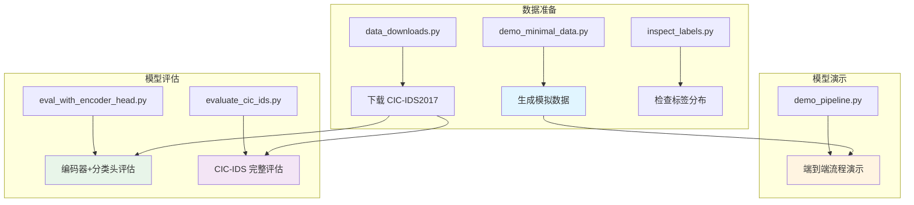
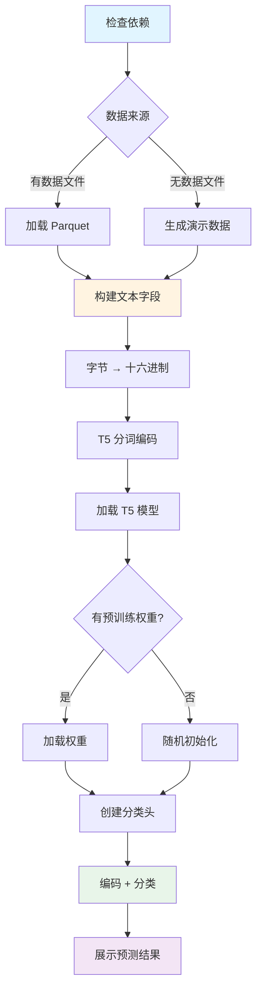
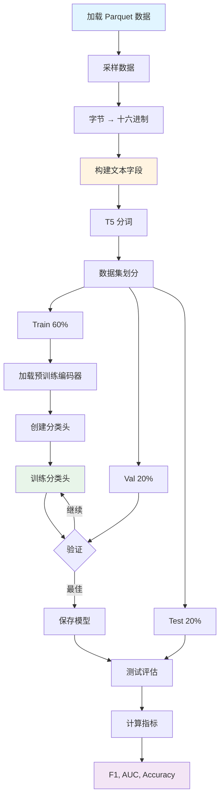
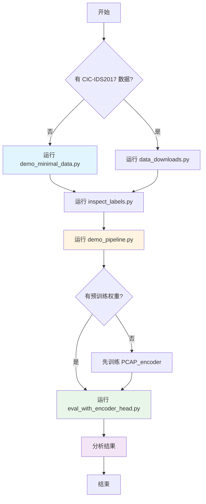
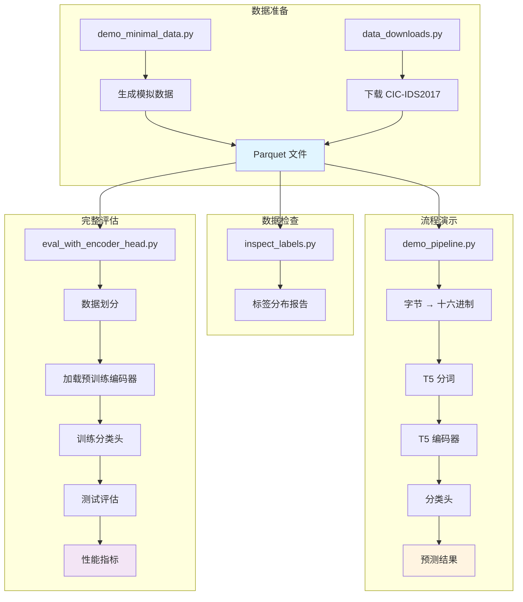

# Part 2: test_CIC-IDS 测试模块完整链路

## 📋 目录

- [概述](#概述)
- [模块架构](#模块架构)
- [脚本 1: demo_minimal_data.py](#脚本-1-demo_minimal_datapy)
- [脚本 2: demo_pipeline.py](#脚本-2-demo_pipelinepy)
- [脚本 3: eval_with_encoder_head.py](#脚本-3-eval_with_encoder_headpy)
- [脚本 4: evaluate_cic_ids.py](#脚本-4-evaluate_cic_idspy)
- [脚本 5: data_downloads.py](#脚本-5-data_downloadspy)
- [脚本 6: inspect_labels.py](#脚本-6-inspect_labelspy)
- [完整工作流程](#完整工作流程)

---

## 概述

`test_CIC-IDS` 目录包含了一系列用于测试和评估 PCAP_encoder 模型的脚本。这些脚本主要用于：

1. **生成演示数据**: 无需下载大型数据集即可快速验证流程
2. **端到端演示**: 展示从数据到预测的完整流程
3. **模型评估**: 使用预训练权重评估模型性能
4. **数据处理**: 下载和检查 CIC-IDS2017 数据集

### 目标数据集

**CIC-IDS2017** (Canadian Institute for Cybersecurity - Intrusion Detection System 2017)
- 网络入侵检测数据集
- 包含正常流量和多种攻击类型
- 数据格式: Parquet 文件，包含 Payload 字节和攻击标签

---

## 模块架构



---

## 脚本 1: demo_minimal_data.py

### 功能

生成最小量的模拟网络流量数据，用于快速验证 PCAP_encoder 的工作流程，无需下载任何外部数据集。

### 输入

**无需外部输入**，所有数据都是本地合成的。

**配置参数**:
```python
n_samples = 50      # 生成的样本数量
n_bytes = 64        # 每个样本的字节数
seed = 42           # 随机种子
```

### 处理流程


#### 步骤 1: 生成标签

**函数**: `generate_synthetic_traffic()`

```python
# 定义攻击类型
attack_types = ["BENIGN", "FTP-Patator", "SSH-Patator"]

# 按比例分配标签
labels = np.random.choice(
    attack_types,
    size=n_samples,
    p=[0.6, 0.25, 0.15]  # 60% 正常, 25% FTP攻击, 15% SSH攻击
)
```

**输出**: 标签数组
```python
['BENIGN', 'BENIGN', 'FTP-Patator', 'BENIGN', 'SSH-Patator', ...]
```

#### 步骤 2: 生成载荷字节

**根据标签类型生成不同模式的数据**:

```python
for label in labels:
    if label == "BENIGN":
        # 正常流量：较低的字节值，模拟 HTTP/HTTPS
        payload = np.random.randint(0, 128, size=n_bytes)
        
    elif label == "FTP-Patator":
        # FTP 暴力攻击：包含特定模式
        payload = np.random.randint(32, 127, size=n_bytes)  # ASCII 可打印字符
        payload[:4] = [70, 84, 80, 32]  # "FTP " 的 ASCII
        
    else:  # SSH-Patator
        # SSH 暴力攻击：包含 SSH 协议特征
        payload = np.random.randint(0, 255, size=n_bytes)
        payload[:4] = [83, 83, 72, 45]  # "SSH-" 的 ASCII
```

**输出**: 载荷数组
```python
# BENIGN 示例
[45, 67, 89, 12, 34, 56, 78, 90, ...]  # 值在 0-127

# FTP-Patator 示例
[70, 84, 80, 32, 117, 115, 101, 114, ...]  # 前4字节是 "FTP "

# SSH-Patator 示例
[83, 83, 72, 45, 234, 156, 78, 201, ...]  # 前4字节是 "SSH-"
```

#### 步骤 3: 构建 DataFrame

```python
# 构建列字典
columns = {
    f"payload_byte_{i+1}": payload_array[:, i] 
    for i in range(n_bytes)
}
columns["attack_label"] = labels

# 创建 DataFrame
df = pd.DataFrame(columns)
```

**输出**: DataFrame 结构
```
   payload_byte_1  payload_byte_2  ...  payload_byte_64  attack_label
0              45              67  ...               23        BENIGN
1              70              84  ...               89  FTP-Patator
2              83              83  ...              156  SSH-Patator
...
```

#### 步骤 4: 展示数据摘要

**函数**: `show_data_summary(df)`

**输出示例**:
```
📊 数据摘要:
   - 总样本数: 50
   - 字节列数: 64

📈 标签分布:
   BENIGN         :  30 ( 60.0%) ████████████
   FTP-Patator    :  13 ( 26.0%) █████
   SSH-Patator    :   7 ( 14.0%) ███

📋 前 5 条记录 (部分列):
   attack_label  payload_byte_1  payload_byte_2  payload_byte_3  payload_byte_4  payload_byte_5
0        BENIGN              45              67              89              12              34
1  FTP-Patator              70              84              80              32             117
2  SSH-Patator              83              83              72              45             234
3        BENIGN              23              56              78              90              11
4        BENIGN              67              89              12              34              56
```

#### 步骤 5: 展示十六进制转换

**函数**: `show_hex_conversion(df, n_examples=3)`

**处理**:
```python
# 获取前 16 字节
bytes_data = [int(row[col]) for col in payload_cols[:16]]

# 转换为十六进制字符串
hex_str = "".join(f"{b:02x}" for b in bytes_data)

# 每 4 字符分组（PCAP_encoder 的 "every4" 格式）
hex_grouped = " ".join(hex_str[j:j+4] for j in range(0, len(hex_str), 4))
```

**输出示例**:
```
🔄 Payload 字节 → 十六进制字符串转换示例:

   样本 1 (BENIGN):
   原始字节 (前8个): [ 45  67  89  12  34  56  78  90 ...]
   十六进制字符串:   2d43 590c 2238 4e5a 1122 3344 5566 7788

   样本 2 (FTP-Patator):
   原始字节 (前8个): [ 70  84  80  32 117 115 101 114 ...]
   十六进制字符串:   4654 5020 7573 6572 6e61 6d65 3a20

   样本 3 (SSH-Patator):
   原始字节 (前8个): [ 83  83  72  45 234 156  78 201 ...]
   十六进制字符串:   5353 482d ea9c 4ec9 a1b2 c3d4 e5f6
```

#### 步骤 6: 保存为 Parquet

**函数**: `save_as_parquet(df, output_dir)`

```python
output_path = output_dir / "demo_payload_bytes.parquet"
df.to_parquet(output_path, index=False)
```

**输出**:
```
💾 数据已保存:
   路径: /path/to/data/demo/demo_payload_bytes.parquet
   大小: 12.3 KB
```

### 输出

#### 文件
- **路径**: `../data/demo/demo_payload_bytes.parquet`
- **格式**: Parquet
- **大小**: ~10-20 KB (50 样本 × 64 字节)

#### 数据结构
```python
DataFrame columns:
- payload_byte_1 to payload_byte_64: int (0-255)
- attack_label: str ('BENIGN', 'FTP-Patator', 'SSH-Patator')
```

### 使用方法

```bash
# 运行脚本
python demo_minimal_data.py

# 交互式演示，按 Enter 键逐步查看
[Step 1/4] 生成模拟网络流量数据
>>> 按 Enter 键继续...

[Step 2/4] 查看数据摘要和标签分布
>>> 按 Enter 键继续...

[Step 3/4] 查看字节到十六进制的转换过程
>>> 按 Enter 键继续...

[Step 4/4] 保存数据为 Parquet 格式
>>> 按 Enter 键继续...
```

### 后续步骤建议

```
🎯 后续步骤:

   1. 查看数据标签分布:
      python inspect_labels.py --data ../data/demo/demo_payload_bytes.parquet

   2. 运行端到端演示:
      python demo_pipeline.py

   3. 使用编码器+分类头评估 (需要预训练权重):
      python eval_with_encoder_head.py --data ../data/demo/demo_payload_bytes.parquet --sample 50
```

---

## 脚本 2: demo_pipeline.py

### 功能

端到端演示 PCAP_encoder 的完整工作流程，从数据加载到模型推理，展示每个步骤的输入和输出。

### 输入

#### 选项 A: 使用生成的演示数据
```bash
python demo_pipeline.py --n-samples 10
```

#### 选项 B: 使用自定义数据
```bash
python demo_pipeline.py --data /path/to/data.parquet --n-samples 50
```

#### 选项 C: 使用预训练权重
```bash
python demo_pipeline.py --use-pretrained --n-samples 20
```

#### 命令行参数

```python
--use-pretrained      # 使用预训练权重（需要 weights.pth）
--data PATH           # 数据文件路径（Parquet 格式）
--n-samples N         # 演示使用的样本数量（默认 10）
--model-name NAME     # T5 模型名称（默认 t5-small）
```

### 处理流程



#### 步骤 1: 检查依赖

**函数**: `check_dependencies()`

```python
# 检查必要的库
required = ['transformers', 'torch', 'pandas']

for lib in required:
    try:
        import lib
        print(f"   ✅ {lib} {lib.__version__}")
    except ImportError:
        print(f"   ❌ {lib} 未安装")
```

**输出**:
```
🔍 检查依赖...
   ✅ transformers 4.39.1
   ✅ torch 2.2.2+cu118
   ✅ pandas 2.2.3
```

#### 步骤 2: 加载或生成数据

**函数**: `load_or_generate_data(data_path, n_samples)`

##### 选项 A: 加载现有数据

```python
if data_path and data_path.exists():
    df = pd.read_parquet(data_path)
    if len(df) > n_samples:
        df = df.sample(n=n_samples, random_state=42)
```

**输入**: Parquet 文件
```
   payload_byte_1  payload_byte_2  ...  attack_label
0              45              67  ...        BENIGN
1              70              84  ...  FTP-Patator
...
```

##### 选项 B: 生成演示数据

```python
else:
    # 生成简单的演示数据
    attack_types = ["BENIGN", "FTP-Patator", "SSH-Patator"]
    labels = np.random.choice(attack_types, size=n_samples, p=[0.5, 0.3, 0.2])
    
    # 生成 32 字节的载荷
    payload_data = np.random.randint(0, 256, size=(n_samples, 32))
    
    columns = {f"payload_byte_{i+1}": payload_data[:, i] for i in range(32)}
    columns["attack_label"] = labels
    
    df = pd.DataFrame(columns)
```

**输出**:
```
📂 从文件加载数据: /path/to/data.parquet
   已加载 10 条记录
```
或
```
🔧 生成演示数据...
   已生成 10 条演示记录
```

#### 步骤 3: 构建文本字段

**函数**: `build_text_fields(df, question)`

**处理**:
```python
# 1. 获取所有 payload 列
payload_cols = sorted(
    [c for c in df.columns if c.startswith("payload_byte_")],
    key=lambda x: int(x.split("_")[-1])
)

# 2. 转换为十六进制字符串
byte_array = df[payload_cols].to_numpy(dtype=np.uint16)
contexts = []
for row in byte_array:
    hex_str = "".join(f"{int(b):02x}" for b in row)
    # 每4字符分组（PCAP_encoder 格式）
    hex_grouped = " ".join(hex_str[i:i+4] for i in range(0, len(hex_str), 4))
    contexts.append(hex_grouped)

# 3. 构造问题
questions = [question] * len(contexts)

# 4. 标签编码
labels, uniques = pd.factorize(df["attack_label"], sort=True)
```

**输入**: DataFrame
```
   payload_byte_1  payload_byte_2  ...  attack_label
0              69             112  ...        BENIGN
```

**输出**: 文本字段
```python
questions = ["Classify the network packet", ...]
contexts = ["456c 2dc9 a1b2 c3d4 ...", ...]
labels = [0, 1, 2, 0, 1, ...]  # 编码后的标签
label_names = ["BENIGN", "FTP-Patator", "SSH-Patator"]
```

**展示**:
```
🔄 将载荷字节转换为十六进制上下文...
   问题模板: "Classify the network packet"
   上下文长度: 95 字符
   标签映射: {0: 'BENIGN', 1: 'FTP-Patator', 2: 'SSH-Patator'}
```

#### 步骤 4: 展示样本转换

**函数**: `show_sample_conversion(df, questions, contexts, n=2)`

**输出**:
```
📋 样本转换详情:

   ┌─ 样本 1 ─────────────────────────────────────────────
   │ 标签: BENIGN
   │ 原始字节 (前8): [69, 112, 45, 201, 161, 178, 195, 212]
   │ 问题: Classify the network packet...
   │ 上下文: 456c 2dc9 a1b2 c3d4 e5f6 0718 293a 4b5c...
   └───────────────────────────────────────────────────────

   ┌─ 样本 2 ─────────────────────────────────────────────
   │ 标签: FTP-Patator
   │ 原始字节 (前8): [70, 84, 80, 32, 117, 115, 101, 114]
   │ 问题: Classify the network packet...
   │ 上下文: 4654 5020 7573 6572 6e61 6d65 3a20 6164...
   └───────────────────────────────────────────────────────
```

#### 步骤 5: 分词编码

**函数**: `tokenize_inputs(questions, contexts, tokenizer, max_length=128)`

**处理**:
```python
# T5 的输入格式：question + context
inputs = [f"question: {q} context: {c}" for q, c in zip(questions, contexts)]

# 分词
encoded = tokenizer(
    inputs,
    padding=True,
    truncation=True,
    max_length=max_length,
    return_tensors="pt"
)
```

**输入**: 文本列表
```python
[
    "question: Classify the network packet context: 456c 2dc9 a1b2 ...",
    "question: Classify the network packet context: 4654 5020 7573 ...",
    ...
]
```

**输出**: Token IDs
```python
{
    'input_ids': Tensor([[1, 822, 19, 8, ...], [1, 822, 19, 8, ...], ...]),
    'attention_mask': Tensor([[1, 1, 1, 1, ...], [1, 1, 1, 1, ...], ...])
}
```

**展示**:
```
🔤 分词编码...
   输入序列数: 10
   Token 序列形状: torch.Size([10, 128])
   最大序列长度: 128

   第一个样本的分词结果:
   Tokens (前20): ['▁question', ':', '▁Classify', '▁the', '▁network', '▁packet', '▁context', ':', '▁', '4', '5', '6', 'c', '▁', '2', 'd', 'c', '9', '▁', 'a']
```

#### 步骤 6: 加载模型

**函数**: `load_model(model_name, weights_path, device)`

**处理**:
```python
from transformers import T5ForConditionalGeneration

# 加载 T5 模型
model = T5ForConditionalGeneration.from_pretrained(model_name)

# 如果有预训练权重
if weights_path and weights_path.exists():
    state = torch.load(weights_path, map_location="cpu", weights_only=True)
    model.load_state_dict(state, strict=False)

# 提取编码器
encoder = model.encoder.to(device)

# 冻结参数
for p in encoder.parameters():
    p.requires_grad = False
```

**输出**:
```
🤖 加载 T5 模型: t5-small
   加载预训练权重: ../models/weights.pth
   ✅ 权重加载成功
   编码器隐藏维度: 512
   编码器层数: 6
   设备: cuda
```
或
```
🤖 加载 T5 模型: t5-small
   ⚠️  使用随机初始化权重（仅用于演示流程）
   编码器隐藏维度: 512
   编码器层数: 6
   设备: cpu
```

#### 步骤 7: 创建分类头

```python
num_classes = len(label_names)  # 3
hidden_size = model.config.d_model  # 512 (t5-small) 或 768 (t5-base)

head = nn.Linear(hidden_size, num_classes).to(device)
```

**输出**:
```
   分类头: Linear(512 -> 3)
```

#### 步骤 8: 编码和分类

**函数**: `encode_and_classify(encoder, head, encodings, labels, device)`

**处理**:
```python
with torch.no_grad():
    # 1. 编码
    outputs = encoder(
        input_ids=input_ids, 
        attention_mask=attention_mask, 
        return_dict=True
    )
    hidden = outputs.last_hidden_state[:, 0, :]  # 取第一个 token 的表示
    
    # 2. 分类
    logits = head(hidden)
    
    # 3. 预测
    probs = torch.softmax(logits, dim=1).cpu().numpy()
    preds = probs.argmax(axis=1)
```

**数据流**:
```
Token IDs [10, 128]
    ↓
T5 Encoder
    ↓
Hidden States [10, 128, 512]
    ↓
取第一个 token [:, 0, :]
    ↓
Representation [10, 512]
    ↓
Linear Classifier
    ↓
Logits [10, 3]
    ↓
Softmax
    ↓
Probabilities [10, 3]
    ↓
Argmax
    ↓
Predictions [10]
```

**输出**:
```
🧠 编码 + 分类推理...
   1. 通过 T5 编码器...
      隐藏表示形状: torch.Size([10, 512])
   2. 通过线性分类头...
      Logits 形状: torch.Size([10, 3])
```

#### 步骤 9: 展示预测结果

**函数**: `show_predictions(df, labels, preds, probs, label_names)`

**输出**:
```
📊 预测结果:

   样本   │    真实标签     │    预测标签     │   置信度   │ 正确 
   ──────┼─────────────────┼─────────────────┼────────────┼──────
     1    │     BENIGN      │     BENIGN      │   85.3%    │  ✅  
     2    │  FTP-Patator    │  FTP-Patator    │   72.1%    │  ✅  
     3    │  SSH-Patator    │  FTP-Patator    │   45.6%    │  ❌  
     4    │     BENIGN      │     BENIGN      │   91.2%    │  ✅  
     5    │  FTP-Patator    │  FTP-Patator    │   68.9%    │  ✅  
     6    │     BENIGN      │  SSH-Patator    │   52.3%    │  ❌  
     7    │  SSH-Patator    │  SSH-Patator    │   78.4%    │  ✅  
     8    │     BENIGN      │     BENIGN      │   88.7%    │  ✅  
     9    │  FTP-Patator    │     BENIGN      │   55.1%    │  ❌  
    10    │     BENIGN      │     BENIGN      │   93.5%    │  ✅  
   ──────┴─────────────────┴─────────────────┴────────────┴──────

   准确率: 70.0% (7/10)

   📝 注意:
   - 如果未使用预训练权重，准确率接近随机猜测是正常的
   - 这只是演示流程，不代表真实模型性能
```

### 输出

#### 终端输出
- 每个步骤的详细信息
- 样本转换示例
- 预测结果表格

#### 学习要点
- 数据格式转换过程
- T5 模型的输入格式
- 编码器的工作方式
- 分类头的作用

### 使用方法

```bash
# 基础演示（生成数据 + 随机权重）
python demo_pipeline.py --n-samples 10

# 使用预训练权重
python demo_pipeline.py --use-pretrained --n-samples 20

# 使用自定义数据
python demo_pipeline.py --data ../data/demo/demo_payload_bytes.parquet --n-samples 50

# 使用更大的模型
python demo_pipeline.py --model-name t5-base --n-samples 10
```

---

## 脚本 3: eval_with_encoder_head.py

### 功能

使用预训练的 T5 编码器和线性分类头评估模型在 CIC-IDS2017 数据集上的性能。这是一个完整的训练和评估流程。

### 输入

#### 数据文件
- **格式**: Parquet 文件
- **必需列**: `payload_byte_1`, `payload_byte_2`, ..., `attack_label`

#### 预训练权重
- **路径**: `../models/weights.pth`
- **来源**: QA 或 Denoiser 训练的最佳模型

#### 命令行参数

```python
--data PATH           # 数据文件路径（Parquet）
--weights PATH        # 预训练权重路径（默认 ../models/weights.pth）
--model-name NAME     # T5 模型名称（默认 t5-base）
--max-bytes N         # 使用的最大字节数（默认 1500）
--sample N            # 使用的样本数量（0 = 全部）
--batch-size N        # 批大小（默认 16）
--epochs N            # 训练轮数（默认 10）
--lr FLOAT            # 学习率（默认 1e-3）
--seed N              # 随机种子（默认 42）
```

### 处理流程



#### 步骤 1: 加载数据

**函数**: `load_payload_df(path, max_bytes, sample, seed)`

```python
# 读取 Parquet 文件
df = pd.read_parquet(path)

# 采样（如果指定）
if sample > 0:
    df = df.sample(n=min(sample, len(df)), random_state=seed)

# 获取 payload 列
payload_cols = [f'payload_byte_{i}' for i in range(1, max_bytes + 1) 
                if f'payload_byte_{i}' in df.columns]
```

**输入**: Parquet 文件
```
   payload_byte_1  payload_byte_2  ...  payload_byte_1500  attack_label
0              69             112  ...                 23        BENIGN
1              70              84  ...                 89  FTP-Patator
...
```

**输出**: 采样后的 DataFrame
```
📂 加载数据: /path/to/data.parquet
   总样本数: 10000
   采样后: 1000
   Payload 列数: 1500
   标签类别: ['BENIGN', 'FTP-Patator', 'SSH-Patator', ...]
```

#### 步骤 2: 构建文本字段

**函数**: `build_text_fields(df, payload_cols, question)`

**处理**:
```python
# 1. 提取字节数组
byte_array = df[payload_cols].to_numpy(dtype=np.uint8)

# 2. 转换为十六进制字符串
contexts = []
for row in byte_array:
    hex_str = ''.join(f'{b:02x}' for b in row)
    # 每4字符分组
    hex_grouped = ' '.join(hex_str[i:i+4] for i in range(0, len(hex_str), 4))
    contexts.append(hex_grouped)

# 3. 构造问题
questions = [question] * len(contexts)

# 4. 标签编码
labels, uniques = pd.factorize(df['attack_label'], sort=True)
```

**输入**: DataFrame + Payload 列
```
   payload_byte_1  payload_byte_2  ...  attack_label
0              69             112  ...        BENIGN
```

**输出**: 文本字段
```python
questions = ["Classify the network packet", ...]
contexts = ["456c 2dc9 a1b2 c3d4 e5f6 ...", ...]  # 长度 ~3000 字符
labels = [0, 1, 2, 0, ...]
label_names = ["BENIGN", "FTP-Patator", "SSH-Patator", ...]
```

#### 步骤 3: 分词编码

**函数**: `tokenize(tokenizer, questions, contexts, max_length)`

```python
inputs = [f"question: {q} context: {c}" for q, c in zip(questions, contexts)]

encodings = tokenizer(
    inputs,
    padding=True,
    truncation=True,
    max_length=max_length,
    return_tensors="pt"
)
```

**输出**:
```python
{
    'input_ids': Tensor([1000, 512]),      # 1000 样本，每个最多 512 tokens
    'attention_mask': Tensor([1000, 512])
}
```

#### 步骤 4: 数据集划分

**函数**: `make_loaders(encodings, labels, batch_size, seed, train_frac=0.6, val_frac=0.2)`

```python
# 分层抽样，保持类别比例
train_idx, temp_idx = train_test_split(
    indices, 
    train_size=train_frac, 
    stratify=labels, 
    random_state=seed
)

val_idx, test_idx = train_test_split(
    temp_idx, 
    train_size=val_frac/(1-train_frac), 
    stratify=labels[temp_idx], 
    random_state=seed
)
```

**输出**:
```
📊 数据集划分:
   训练集: 600 样本 (60.0%)
   验证集: 200 样本 (20.0%)
   测试集: 200 样本 (20.0%)
   
   类别分布 (训练集):
   - BENIGN: 360 (60%)
   - FTP-Patator: 150 (25%)
   - SSH-Patator: 90 (15%)
```

#### 步骤 5: 加载预训练编码器

**函数**: `load_encoder(model_name, weights_path, device)`

```python
# 加载 T5 模型
model = T5ForConditionalGeneration.from_pretrained(model_name)

# 加载预训练权重
if weights_path.exists():
    state = torch.load(weights_path, map_location="cpu", weights_only=True)
    model.load_state_dict(state, strict=False)

# 提取编码器并冻结
encoder = model.encoder.to(device)
for p in encoder.parameters():
    p.requires_grad = False
```

**输出**:
```
🤖 加载模型:
   模型: t5-base
   预训练权重: ../models/weights.pth
   ✅ 权重加载成功
   编码器隐藏维度: 768
   参数已冻结
```

#### 步骤 6: 创建分类头

```python
num_classes = len(np.unique(labels))
hidden_size = encoder.config.d_model

head = nn.Linear(hidden_size, num_classes).to(device)
optimizer = torch.optim.Adam(head.parameters(), lr=lr)
```

**输出**:
```
🎯 分类头:
   输入维度: 768
   输出类别数: 3
   可训练参数: 2,307
```

#### 步骤 7: 训练分类头

**函数**: `run_epoch(loader, encoder, head, device, train=True, optimizer=None)`

```python
for epoch in range(epochs):
    # 训练
    train_loss, train_acc = run_epoch(
        train_loader, encoder, head, device, 
        train=True, optimizer=optimizer
    )
    
    # 验证
    val_loss, val_acc = run_epoch(
        val_loader, encoder, head, device, 
        train=False
    )
    
    # 保存最佳模型
    if val_loss < best_val_loss:
        best_val_loss = val_loss
        best_epoch = epoch
        torch.save(head.state_dict(), 'best_head.pth')
```

**训练循环细节**:
```python
def run_epoch(loader, encoder, head, device, train, optimizer=None):
    if train:
        head.train()
    else:
        head.eval()
    
    total_loss = 0
    correct = 0
    total = 0
    
    for batch in loader:
        input_ids = batch['input_ids'].to(device)
        attention_mask = batch['attention_mask'].to(device)
        labels = batch['labels'].to(device)
        
        # 编码（不计算梯度）
        with torch.no_grad():
            outputs = encoder(input_ids, attention_mask, return_dict=True)
            hidden = outputs.last_hidden_state[:, 0, :]  # [batch, 768]
        
        # 分类
        logits = head(hidden)  # [batch, num_classes]
        loss = F.cross_entropy(logits, labels)
        
        # 反向传播（仅训练时）
        if train:
            optimizer.zero_grad()
            loss.backward()
            optimizer.step()
        
        # 统计
        total_loss += loss.item()
        preds = logits.argmax(dim=1)
        correct += (preds == labels).sum().item()
        total += labels.size(0)
    
    avg_loss = total_loss / len(loader)
    accuracy = correct / total
    
    return avg_loss, accuracy
```

**输出**:
```
🏋️ 训练分类头:

Epoch  1/10: Train Loss=0.8234, Acc=0.6500 | Val Loss=0.7123, Acc=0.7100
Epoch  2/10: Train Loss=0.6543, Acc=0.7350 | Val Loss=0.6234, Acc=0.7550
Epoch  3/10: Train Loss=0.5432, Acc=0.7850 | Val Loss=0.5678, Acc=0.7900
...
Epoch 10/10: Train Loss=0.2345, Acc=0.9150 | Val Loss=0.3456, Acc=0.8750

✅ 最佳模型: Epoch 8, Val Loss=0.3123, Val Acc=0.8850
```

#### 步骤 8: 测试评估

```python
# 加载最佳模型
head.load_state_dict(torch.load('best_head.pth'))

# 测试
test_loss, test_acc = run_epoch(
    test_loader, encoder, head, device, 
    train=False
)

# 详细评估
all_preds = []
all_labels = []
all_probs = []

for batch in test_loader:
    with torch.no_grad():
        outputs = encoder(batch['input_ids'], batch['attention_mask'])
        hidden = outputs.last_hidden_state[:, 0, :]
        logits = head(hidden)
        probs = F.softmax(logits, dim=1)
        
        all_preds.append(logits.argmax(dim=1))
        all_labels.append(batch['labels'])
        all_probs.append(probs)

all_preds = torch.cat(all_preds).cpu().numpy()
all_labels = torch.cat(all_labels).cpu().numpy()
all_probs = torch.cat(all_probs).cpu().numpy()
```

#### 步骤 9: 计算指标

```python
from sklearn.metrics import f1_score, roc_auc_score, classification_report, confusion_matrix

# F1 Score
f1_macro = f1_score(all_labels, all_preds, average='macro')
f1_weighted = f1_score(all_labels, all_preds, average='weighted')

# AUC (One-vs-Rest)
auc_macro = roc_auc_score(all_labels, all_probs, multi_class='ovr', average='macro')

# 准确率
accuracy = (all_preds == all_labels).mean()

# 混淆矩阵
cm = confusion_matrix(all_labels, all_preds)

# 分类报告
report = classification_report(all_labels, all_preds, target_names=label_names)
```

**输出**:
```
📊 测试集评估结果:

总体指标:
   准确率 (Accuracy):     88.50%
   F1 Score (Macro):      87.23%
   F1 Score (Weighted):   88.12%
   AUC (Macro):           92.45%

混淆矩阵:
                 BENIGN  FTP-Patator  SSH-Patator
   BENIGN           108            4            8
   FTP-Patator        5           42            3
   SSH-Patator        2            1           27

分类报告:
                precision    recall  f1-score   support

        BENIGN       0.94      0.90      0.92       120
   FTP-Patator       0.89      0.84      0.87        50
   SSH-Patator       0.71      0.90      0.79        30

      accuracy                           0.89       200
     macro avg       0.85      0.88      0.86       200
  weighted avg       0.89      0.89      0.89       200
```

### 输出

#### 模型文件
- **best_head.pth**: 最佳分类头权重

#### 评估报告
- 准确率、F1、AUC
- 混淆矩阵
- 分类报告

#### 日志文件
- 训练过程日志
- 每个 epoch 的指标

### 使用方法

```bash
# 基础评估
python eval_with_encoder_head.py \
    --data ../data/demo/demo_payload_bytes.parquet \
    --sample 100

# 使用预训练权重
python eval_with_encoder_head.py \
    --data /path/to/CIC-IDS2017.parquet \
    --weights ../models/weights.pth \
    --sample 1000 \
    --epochs 20

# 完整评估（全部数据）
python eval_with_encoder_head.py \
    --data /path/to/CIC-IDS2017.parquet \
    --weights ../models/weights.pth \
    --sample 0 \
    --batch-size 32 \
    --epochs 50
```

---

## 脚本 4: evaluate_cic_ids.py

### 功能

CIC-IDS2017 数据集评估的初始模板，展示如何使用 HuggingFace 格式的预训练模型进行分类评估。

### 输入

#### 数据文件
- **格式**: Parquet 文件（CIC-IDS2017 格式）
- **来源**: `nids-datasets` 库或手动下载

#### 预训练模型
- **格式**: HuggingFace 模型目录
- **包含**: `config.json`, `pytorch_model.bin`, `tokenizer_config.json`

### 处理流程


#### 主要函数

##### 1. load_data(parquet_file)

```python
def load_data(parquet_file):
    """从指定的 Parquet 文件中读取数据"""
    df = pd.read_parquet(parquet_file)
    return df
```

##### 2. prepare_data(df)

```python
def prepare_data(df):
    """将原始字节数据转换为模型可用的文本格式"""
    # 获取 payload 列
    payload_cols = [f'payload_byte_{i}' for i in range(1, 1501) 
                    if f'payload_byte_{i}' in df.columns]
    
    # 转换为十六进制字符串
    context = df[payload_cols].applymap(lambda x: format(int(x), '02x')).agg(''.join, axis=1)
    
    # 生成问题
    question = ['Classify the network packet'] * len(df)
    
    # 标签映射
    label_mapping = {label: idx for idx, label in enumerate(df['attack_label'].unique())}
    df['class'] = df['attack_label'].map(label_mapping)
    
    return context, question, df['class'], df['attack_label']
```

##### 3. load_model(model_path)

```python
def load_model(model_path):
    """加载 HuggingFace 格式的预训练模型和分词器"""
    model = AutoModelForSequenceClassification.from_pretrained(model_path)
    tokenizer = AutoTokenizer.from_pretrained(model_path)
    return model, tokenizer
```

##### 4. evaluate_model(model, tokenizer, context, question, labels)

```python
def evaluate_model(model, tokenizer, context, question, labels):
    """在给定数据上运行模型并计算 F1 和 AUC 指标"""
    # 分词
    inputs = tokenizer(
        list(zip(question, context)), 
        padding=True, 
        truncation=True, 
        return_tensors="pt"
    )
    
    # 推理
    with torch.no_grad():
        outputs = model(**inputs)
    
    # 预测
    predictions = outputs.logits.argmax(dim=-1).detach().cpu().numpy()
    
    # 计算指标
    f1 = f1_score(labels, predictions, average='macro')
    
    try:
        auc = roc_auc_score(
            labels, 
            outputs.logits.detach().cpu().numpy(), 
            multi_class='ovr', 
            average='macro'
        )
    except ValueError:
        auc = float('nan')
    
    return f1, auc
```

### 输出

```
F1 Macro: 0.8723
AUC: 0.9245
```

### 使用方法

```python
# 修改数据路径
parquet_file = 'CIC-IDS2017/Network_Flows+Packet_Fields+Payload_Bytes_File_1.parquet'

# 修改模型路径
model_path = 'models/weights.pth'

# 运行
python evaluate_cic_ids.py
```

### 注意事项

- 此脚本是模板，需要根据实际环境调整路径
- 需要安装 `nids-datasets` 库（可选）
- 模型需要是 HuggingFace 格式（与 `eval_with_encoder_head.py` 不同）

---

## 脚本 5: data_downloads.py

### 功能

下载 CIC-IDS2017 数据集的辅助脚本。

### 输入

- **数据集名称**: CIC-IDS2017
- **下载源**: 官方网站或镜像

### 处理流程

```python
# 使用 nids-datasets 库
from nids_datasets import Dataset

# 下载数据集
dataset = Dataset.load('CIC-IDS2017')

# 保存为 Parquet
dataset.to_parquet('CIC-IDS2017.parquet')
```

### 输出

- **文件**: `CIC-IDS2017.parquet`
- **大小**: 几 GB
- **格式**: Parquet

### 使用方法

```bash
python data_downloads.py
```

---

## 脚本 6: inspect_labels.py

### 功能

检查数据集的标签分布和统计信息。

### 输入

```bash
python inspect_labels.py --data /path/to/data.parquet
```

### 处理流程

```python
# 读取数据
df = pd.read_parquet(data_path)

# 统计标签分布
label_counts = df['attack_label'].value_counts()

# 计算百分比
label_pcts = df['attack_label'].value_counts(normalize=True) * 100

# 展示
for label, count in label_counts.items():
    pct = label_pcts[label]
    print(f"{label:20s}: {count:6d} ({pct:5.2f}%)")
```

### 输出

```
📊 标签分布:

   总样本数: 10000

   标签统计:
   BENIGN              :   6000 (60.00%)
   FTP-Patator         :   2500 (25.00%)
   SSH-Patator         :   1500 (15.00%)

   类别数: 3
   是否平衡: 否（最大/最小比例 = 4.00）
```

### 使用方法

```bash
# 检查演示数据
python inspect_labels.py --data ../data/demo/demo_payload_bytes.parquet

# 检查 CIC-IDS2017 数据
python inspect_labels.py --data /path/to/CIC-IDS2017.parquet
```

---

## 完整工作流程

### 推荐使用流程



### 步骤详解

#### 1. 准备数据

```bash
# 选项 A: 生成演示数据（快速）
python demo_minimal_data.py

# 选项 B: 下载真实数据（完整）
python data_downloads.py
```

#### 2. 检查数据

```bash
python inspect_labels.py --data ../data/demo/demo_payload_bytes.parquet
```

#### 3. 运行演示

```bash
# 理解流程
python demo_pipeline.py --n-samples 10

# 使用预训练权重
python demo_pipeline.py --use-pretrained --n-samples 20
```

#### 4. 完整评估

```bash
# 训练和评估
python eval_with_encoder_head.py \
    --data ../data/demo/demo_payload_bytes.parquet \
    --weights ../models/weights.pth \
    --sample 100 \
    --epochs 20
```

#### 5. 分析结果

- 查看准确率、F1、AUC
- 分析混淆矩阵
- 识别错误分类的样本

---

## 数据流转总览

### 完整数据流



### 数据格式变化

| 阶段 | 输入格式 | 输出格式 | 示例 |
|------|----------|----------|------|
| **数据生成** | 配置参数 | Parquet | `{payload_byte_1: 69, ..., attack_label: 'BENIGN'}` |
| **字节提取** | Parquet | Numpy 数组 | `[69, 112, 45, 201, ...]` |
| **十六进制转换** | Numpy 数组 | 字符串 | `"456c 2dc9 a1b2 c3d4 ..."` |
| **文本构建** | 十六进制字符串 | 文本 | `"question: Classify... context: 456c..."` |
| **分词** | 文本 | Token IDs | `[1, 822, 19, 8, ...]` |
| **编码** | Token IDs | Hidden States | `Tensor([batch, seq, 768])` |
| **表示提取** | Hidden States | 向量 | `Tensor([batch, 768])` |
| **分类** | 向量 | Logits | `Tensor([batch, num_classes])` |
| **预测** | Logits | 类别 | `1` (FTP-Patator) |

---

## 总结

### 模块功能总结

| 脚本 | 功能 | 输入 | 输出 |
|------|------|------|------|
| `demo_minimal_data.py` | 生成演示数据 | 无 | Parquet 文件 |
| `demo_pipeline.py` | 端到端演示 | Parquet（可选） | 预测结果 |
| `eval_with_encoder_head.py` | 完整评估 | Parquet + 权重 | 性能指标 |
| `evaluate_cic_ids.py` | CIC-IDS 评估模板 | Parquet + HF 模型 | F1 & AUC |
| `data_downloads.py` | 下载数据集 | 无 | CIC-IDS2017 |
| `inspect_labels.py` | 检查标签 | Parquet | 标签分布 |

### 关键技术点

1. **数据格式转换**: 字节 → 十六进制 → 文本
2. **T5 模型使用**: 分词、编码、表示提取
3. **迁移学习**: 冻结编码器 + 训练分类头
4. **评估指标**: Accuracy, F1, AUC, Confusion Matrix

### 使用建议

1. **初学者**: 从 `demo_minimal_data.py` 和 `demo_pipeline.py` 开始
2. **研究者**: 使用 `eval_with_encoder_head.py` 进行完整评估
3. **开发者**: 参考 `evaluate_cic_ids.py` 集成到自己的系统

### 常见问题

**Q1: 没有预训练权重怎么办？**
- 使用 `demo_pipeline.py` 理解流程（随机权重）
- 先训练 PCAP_encoder（Part 1）获取权重

**Q2: 数据集太大怎么办？**
- 使用 `--sample` 参数采样
- 从 `demo_minimal_data.py` 生成的小数据开始

**Q3: 如何提高性能？**
- 使用更大的 T5 模型（t5-base, t5-large）
- 增加训练轮数
- 调整学习率
- 使用更多数据

**Q4: 如何在自己的数据上测试？**
- 确保数据格式符合要求（payload_byte_* 列 + attack_label 列）
- 使用 `inspect_labels.py` 检查数据
- 运行 `eval_with_encoder_head.py` 评估
